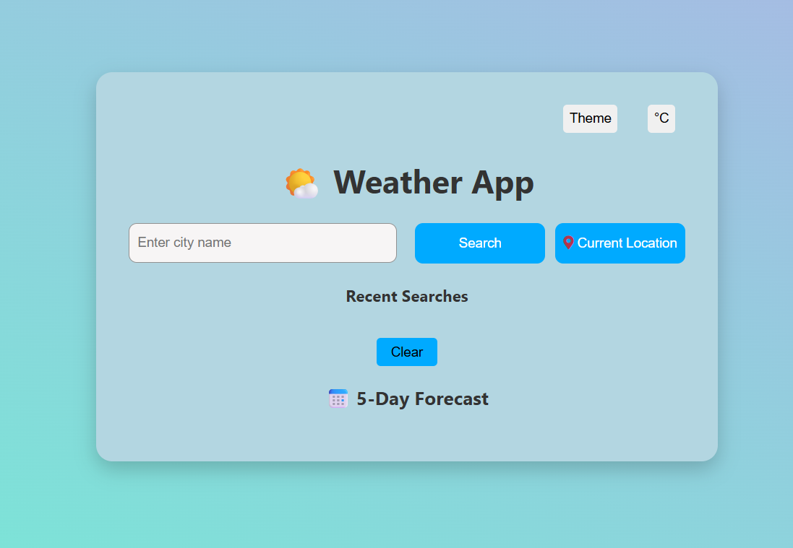

# 🌤️ Weather App

A modern, responsive weather application built using **HTML**, **CSS**, and **JavaScript**, with support for:

- 🔍 City search
- 📍 Current location weather (Geolocation API)
- 🌡️ Temperature toggle (°C/°F)
- 🌓 Dark/Light mode
- 📆 5-Day forecast
- 🔄 Loading animations
- 💾 Local storage for recent searches

> ✅ Deployed via [GitHub Pages](https://vasudevgautam.github.io/weather-app)

---

## 🚀 Demo

🔗 [Live Demo](https://vasudevgautam.github.io/weather-app)  
📱 Fully responsive on mobile & desktop.

---

## 📸 Preview



---

## 🛠️ Technologies Used

- HTML5
- CSS3 (Dark Mode, Transitions, Animations)
- JavaScript (Fetch API, DOM, Local Storage, Geolocation)
- OpenWeatherMap API

---

## 🔑 Setup Instructions

### 1. Clone the Repository

```bash
git clone https://github.com/yourusername/weather-app.git
cd weather-app
----
###2.Add Your API Key
Sign up at OpenWeatherMap

Get your API Key

Replace the placeholder in script.js:
const API_KEY = "YOUR_OPENWEATHERMAP_API_KEY"; // ← Replace this
____
3. Run Locally
Simply open index.html in your browser.
📦 Deployment (via GitHub Pages)
1.Push your project to GitHub.
2.Go to Repository → Settings → Pages
3.Select:
    . Branch: main
    .Folder: / (root)
4. GitHub will give you a URL like:
    https://yourusername.github.io/weather-app/
✨ Features
✅ City-based weather search

✅ Current location weather (GPS)

✅ Forecast for next 5 days

✅ Toggle between °C / °F

✅ Dark / Light mode

✅ Animations and transitions

✅ Local storage for search history

📂 Folder Structure
weather-app/
├── index.html
├── style.css
├── script.js
└── README.md
🔐 Note on API Key Security
This project is frontend-only, so the API key is exposed. For production apps, consider using a backend proxy to hide the key.

💡 Future Improvements
Air Quality Index (AQI) support

Multi-language localization

Unit test coverage with Jest
🧑‍💻 Author
Made with ❤️ by vasudev_gautam(your name)
📝 License
This project is licensed under the MIT License.

---

### 📌 How to Use It

1. Save the content above into a file named `README.md`
2. Replace:
   - `yourusername`
   - `YOUR_OPENWEATHERMAP_API_KEY`
   - Any screenshot or author info
3. Commit it to your repo:

```bash
git add README.md
git commit -m "Add project README"
git push


